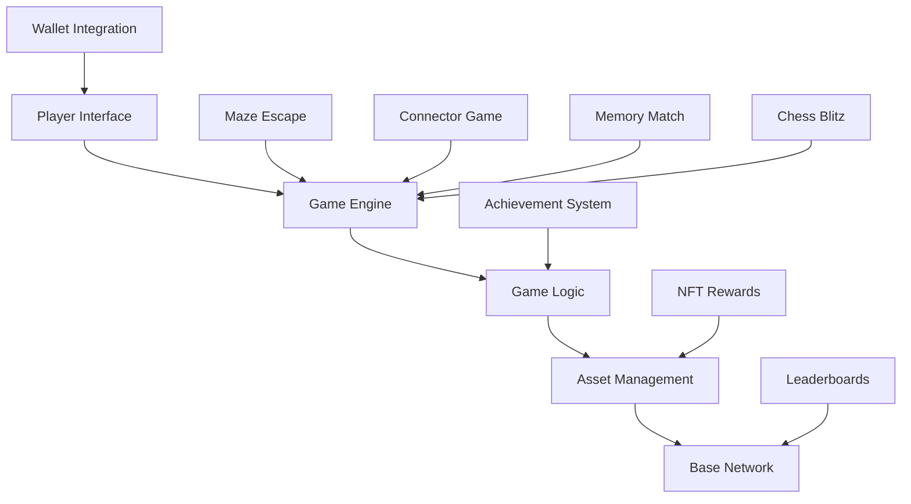
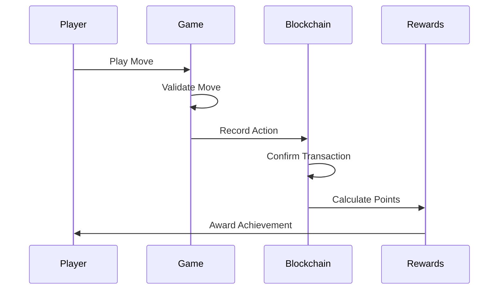
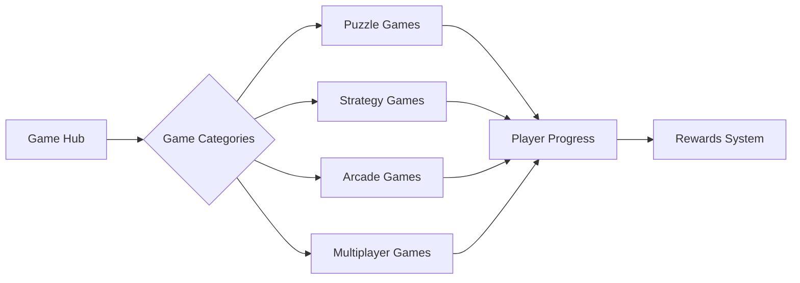
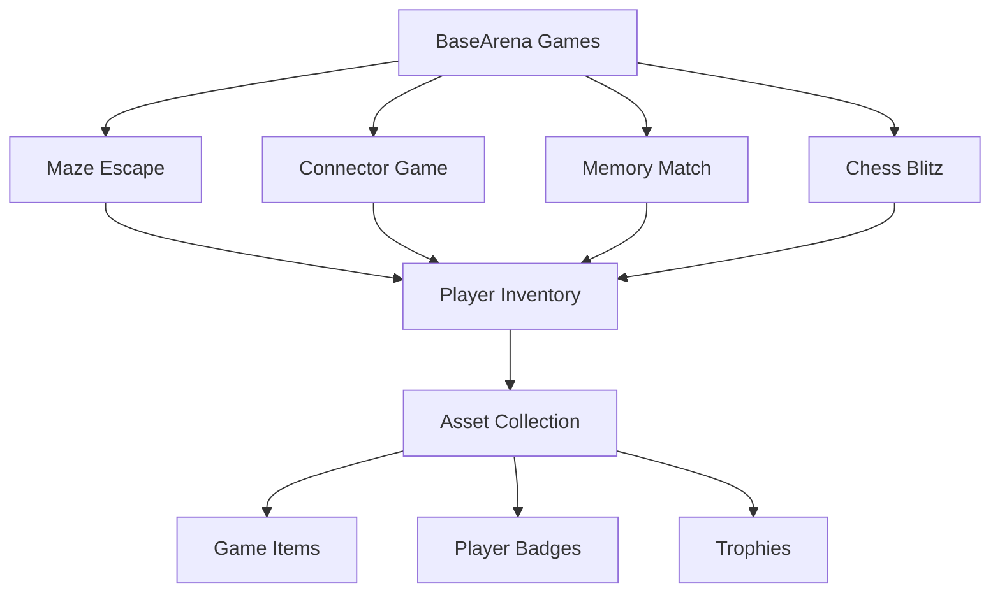
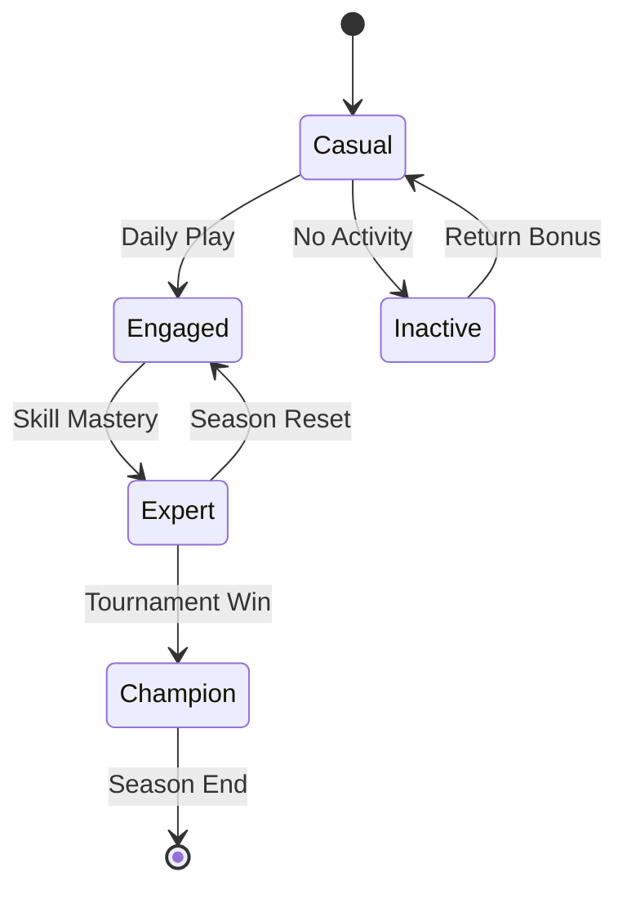
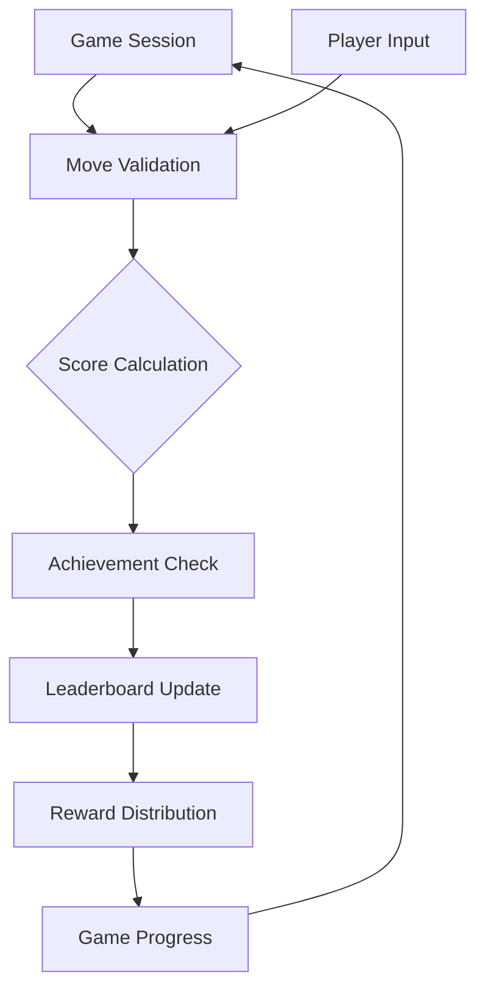
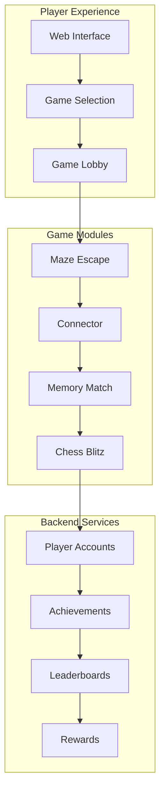

# BaseArena: Blockchain Gaming Platform

BaseArena is a revolutionary collection of blockchain-based games built on the Base Layer-2 network, offering immersive gaming experiences with on-chain interactions, achievements, and rewards.

## Game Platform Overview

BaseArena features a multi-layered architecture that provides players with a seamless gaming experience while maintaining secure blockchain integration.

## Game Features

BaseArena offers several innovative gaming experiences:

### 1. Secure Gameplay Validation

Our advanced validation system ensures fair gameplay while maintaining fast response times, preventing cheating and ensuring all achievements are legitimately earned.

### 2. Private Game States

BaseArena's game state system ensures player privacy while maintaining fair gameplay, allowing players to enjoy games without compromising their personal information.

### 3. Game Categories

Our diverse game categories offer something for every type of player:

### 4. Efficient Blockchain Integration

BaseArena efficiently integrates with blockchain technology to provide secure, verifiable game achievements and rewards while minimizing transaction costs.

## Game Collection

BaseArena features a growing collection of blockchain-enabled games:

## Player Progression Model

BaseArena's player progression system is designed to reward engagement and skill development through a structured advancement path:

## Game Session Flow

Our game session flow ensures fair gameplay with proper validation and reward distribution:

## Security Features

BaseArena implements advanced security features to protect players and their assets:

- **Secure Authentication**: Multi-factor authentication for account protection
- **Encrypted Communications**: End-to-end encryption for player interactions
- **Tamper-Proof Records**: Blockchain-based achievement verification
- **Asset Protection**: Secure storage for player-owned digital items

## Game Platform Architecture

## Future Game Roadmap

Our upcoming development focuses on several exciting new features:

1. **Tournament System** for competitive gameplay with prizes
2. **Advanced AI Opponents** for challenging single-player experiences
3. **Social Gaming Features** for connecting with friends
4. **Mobile-Optimized Gameplay** for gaming on the go
5. **Expanded Game Library** with new titles and genres

## Conclusion

BaseArena represents a paradigm shift in blockchain gaming, combining innovative game mechanics with blockchain technology to create an unparalleled gaming experience that is engaging, rewarding, and secure.