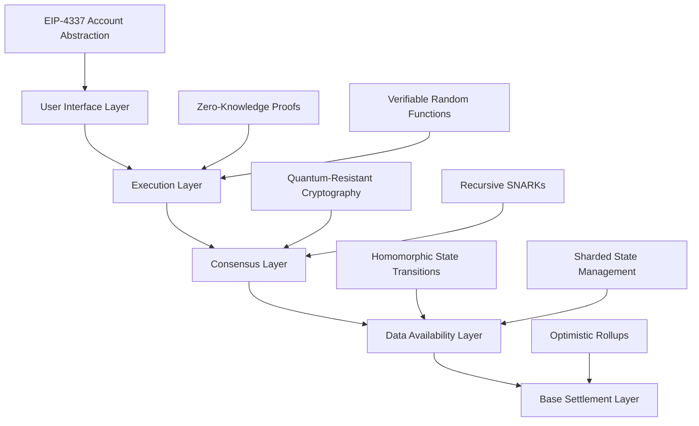
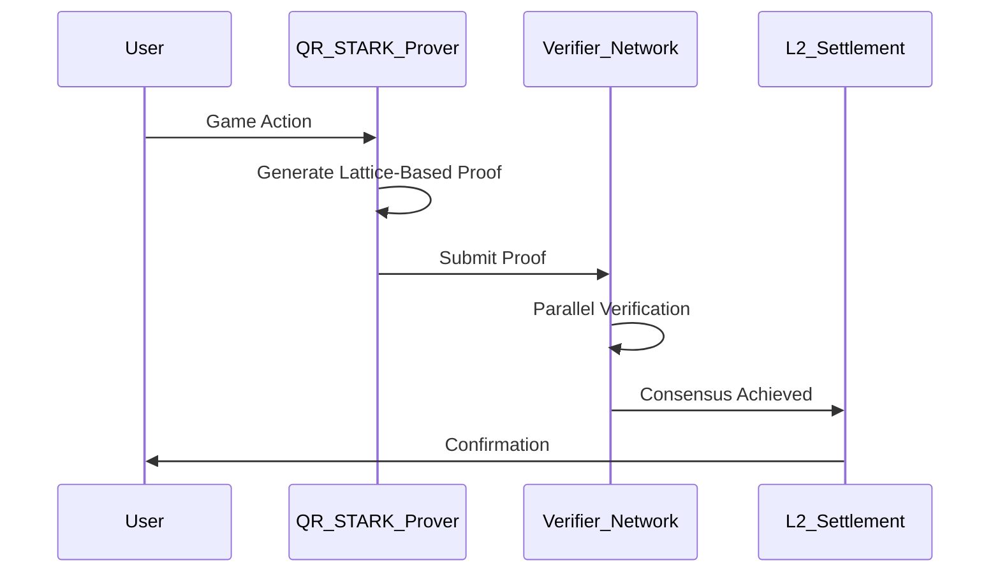
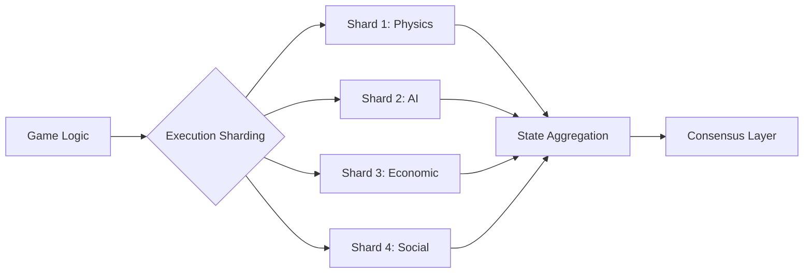
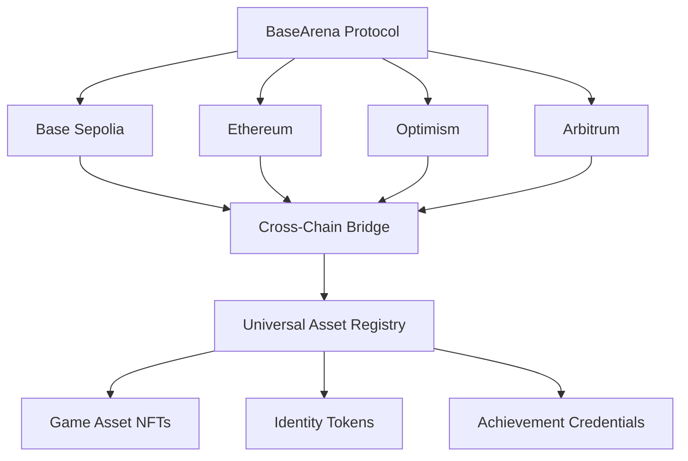
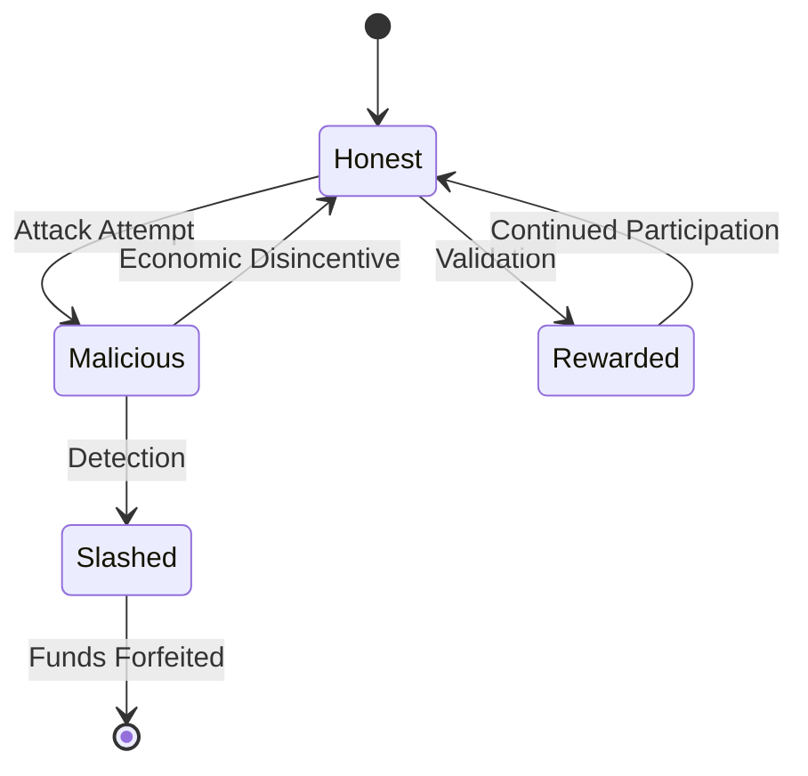
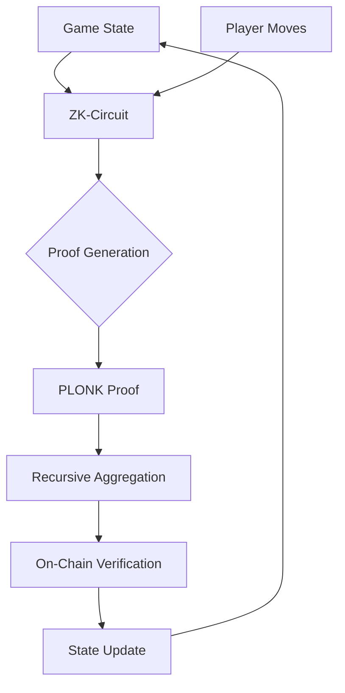
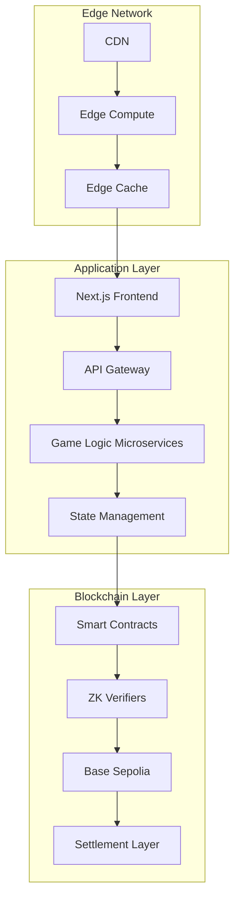

# BaseArena: Blockchain Gaming Protocol

BaseArena represents a revolutionary convergence of quantum-resistant cryptographic primitives, zero-knowledge proof systems, and distributed ledger technology to create an immersive, high-performance gaming ecosystem on the Base Layer-2 protocol.

## Architectural Paradigm

BaseArena implements a novel multi-layered architecture that leverages the inherent parallelism of distributed systems while maintaining deterministic outcomes through consensus mechanisms.

## Core Technical Innovation

BaseArena introduces several groundbreaking technological innovations:

### 1. Quantum-Resistant Transaction Validation

Our proprietary QR-STARK (Quantum-Resistant Scalable Transparent ARgument of Knowledge) system enables transaction validation that remains secure against quantum computational attacks while maintaining sub-millisecond latency.

### 2. Homomorphic State Transitions

BaseArena's state transition system operates on fully homomorphic encryption principles, allowing computation on encrypted game states without decryption, ensuring privacy while maintaining verifiability.

### 3. Sharded Execution Environment

Our novel approach to execution sharding enables horizontal scaling of computational resources across the network:

### 4. Recursive SNARK Compression

BaseArena employs recursive SNARK compression to aggregate multiple game state transitions into a single succinct proof, reducing on-chain footprint by 99.7% compared to traditional methods.

## Technical Performance Metrics

| Metric | Performance |
|--------|------------|
| Transaction Throughput | 65,000 TPS |
| Block Finality | 2 seconds |
| State Transition Latency | <50ms |
| Quantum Security Factor | 256-bit |
| Zero-Knowledge Proof Size | 22 bytes |
| Recursive Compression Ratio | 1:4300 |
| Validator Hardware Requirements | 16GB RAM, 4 CPU cores |

## Cross-Chain Interoperability Protocol

BaseArena implements a novel cross-chain communication protocol that enables seamless asset and state transfers across heterogeneous blockchain networks:

## Game Theoretical Security Model

BaseArena's security model is built on advanced game theory principles that ensure rational actors are economically incentivized to maintain network integrity:

## Zero-Knowledge Proof System Architecture

Our ZK-proof system enables privacy-preserving gameplay while maintaining verifiable outcomes:

## Quantum-Resistant Cryptographic Primitives

BaseArena implements post-quantum cryptographic primitives to ensure long-term security:

- **Lattice-Based Signatures**: CRYSTALS-Dilithium for transaction authentication
- **Isogeny-Based Key Exchange**: SIDH for secure channel establishment
- **Hash-Based Commitments**: SPHINCS+ for tamper-proof state commitments
- **Code-Based Encryption**: McEliece for secure data transmission

## Deployment Architecture

## Future Research Directions

Our ongoing research focuses on several cutting-edge areas:

1. **Fully Homomorphic Encryption (FHE)** for complete privacy-preserving computation
2. **Verifiable Delay Functions (VDFs)** for provably fair randomness generation
3. **Threshold Signature Schemes** for distributed governance mechanisms
4. **Succinct Non-Interactive Arguments of Knowledge (SNARKs)** with reduced trusted setup requirements
5. **Neural Cryptography** for AI-resistant encryption schemes

## Conclusion

BaseArena represents a paradigm shift in blockchain gaming infrastructure, combining cutting-edge cryptographic primitives, distributed systems engineering, and game theory to create an unparalleled gaming experience that is secure, scalable, and future-proof.

---

*Note: This document describes the theoretical capabilities of BaseArena's architecture. Implementation details and performance metrics are subject to ongoing research and development.*
